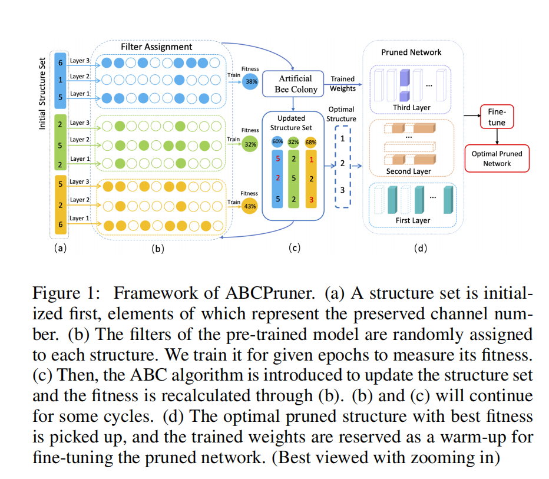

# ABCPruner

## Abstract

- They propose a new channel pruning method based on artificial bee colony algorithm
  - First shrink the combinations
  - And then use ABC algorithm to search the optimal pruned structure
- The search is in a automatic manner and fine-tuning is in an end-to-end manner.

## Introduction

- Why we need to compress the CNNs?
  - high computing power
  - high footprint
  - can't be apply in mobile devices

- Prevalent compression methods:
  - quantization
  - decomposition
  - pruning: channel pruning is one of the most effective tools for compressing CNNs
- Two mainstream methods for channel pruning:
  - identify the most important channel and then fine-tuning : time-cost
  - handcrafted rule to regularize the retraining of a full model followed by pruning and fine-tuning : require human experts and not automatic  and less practical and usually produce the sub-optimal pruning
- motivation
  - ==the essence of channel pruning lies in finding optimal pruned structure,i.e., channel number in each layer, instead of selecting "important" channels==
  - [He at al.] proved the feasibility of applying automatic methods for controlling hyper-parameters to channel pruning, which require less human interference.
- The combinations of pruned structure could be $\prod_{j=1}^{L}c_j$ ,where $c_j$ is the channel number in the j-th layer
- Two strategies in ABCPruner:
  - shrink the combinations by limiting the number of preserved channels to $\{ 0.1c_j,0.2c_j,\dots,\alpha c_j\}$, the combinations will be significantly reduced to $(10\alpha)^L<< \prod_{j=1}^Lc_j$
  - use ABC to find optimal pruned structure
- 
- As shown in figure 1:
  - first initialize a structure set, element of which represents the preserved channel number in each layer
  - the filter weights of the full model are randomly selected and assigned to initialize each structure.
  - train it  for a given number of epochs to measure its fitness
  - then ABC update the structure set.
  - Similarly, filter assignment, training and fitness calculation for the updated structure are conducted.
  - continue search for some cycles
  - finally get the optimal pruned structure, and it's weight are reserved as a warm-up for fine-tuning
- The ABCPruner is differ from [Liu et al]
  - two stage vs one stage
  - the combinations drastically reduced to $(10\alpha)^L$

## Related Work

### Network Pruning

- weight pruning  : 
  - remove individual neurons in the filters or connections across different layers. 
  - need customized hardware and software to support practical speedup
- channel pruning:
  - removing the entire redundant filters directly
  - usually require another round of retraining and manual hyper-parameter analysis.
  - ABCPruner is automatic and end-to-end

### AutoML.

- Most prior AutoML based pruning methods are implemented in a bottom-up and layer-by-layer manner.
- Q-value
- automatic feedback loop
- constraint-aware optimization via annealing strategy
- sparsity-constraint regularzation via a joint training manner

## The Proposed ABCPruner

### Optimal Pruned Structure

- Find best $C'$
- 

### Combination Shrinkage

- $\alpha$ is a pre-given constant and shared across all layers
- $c'_i \le \alpha c_i$

- decrease the combinations to $(10\alpha)^L$

### Automatic Structure Search

- 
- 
- 

## Experiments

### Implementation Details

- Training Stretegy

  - SGD
  - momentum : 0.9
  - batch size 256
  - Cifar 10:
    - learning rate 0.01 devided by 10 every 50 training epoches
    - weight decay : 5 e-3
    - 150 epochs

  - ILSVRC-2012
    - weight decay is 1e-4
    - 90 epochs
    - learning rate 0.1 devided by 10 every 30 epochs

- Performance Metric

  - Channel number
  - FLOPS
  - parameters
  - Cifar-10 top-1
  - ILSVRC-2012 top-1 and top-5
  - $\tau=2, n=3,m=2$

### Result on CIFAR-10

### Result on ILSVRC-2012

- The deeper network contains more pointless parameters

- The ABCPruner can automatically obtain optimal pruned structure which then feeds back good performance

### Comparison with Other Methods

- ABCPruner is more advantageous in finding the optimal pruned structure
- ABCPruner is more efficient compared to the SOTAs

### The Influence of $\alpha$

- The larger $\alpha$ leads less reductions of channel, parameters and FLOPs, but better accuracy performance. To balance the accuracy performance and model complexity reducion, set $\alpha=70\%$

## Conclusion

- Introduce a novel channel pruning method-----ABCPrunner
- first shrink the combinations
- use artificial bee colony to find optimal pruned structure in automatic manner

## 资料

[优化算法——人工蜂群算法(ABC)_null的专栏-CSDN博客](https://felix.blog.csdn.net/article/details/26164653?spm=1001.2101.3001.6650.5&utm_medium=distribute.pc_relevant.none-task-blog-2~default~CTRLIST~default-5.no_search_link&depth_1-utm_source=distribute.pc_relevant.none-task-blog-2~default~CTRLIST~default-5.no_search_link)
