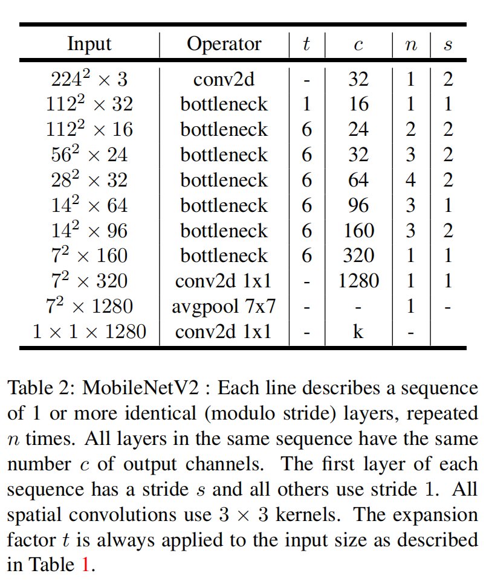

# MobileNetV2

[TOC]

## Abstract

- A new mobile architecture MobileNetV2
- Object detection : SSDLite

- Semanic segmentation : Mobile DeepLabv3
- based on inverted residual structure between the thin bottleneck layers

## Introduction

- main contribution
  - the inverted residual with linear bottleneck
  - the input is low-dimension which is first expanded to high dimension and filtered with a lightweight depthwise convolution. And features finally projected back to a low-dimensional representation with a linear convolution
- beat state of the art

## Related Work

- a substantial amount of work has been dedicated to changing the connnectivity structure of the internal convolutional blocks.
- The resulting networks of architectural search is complex.
- base on MobileNetV1
  - retain simplicity
  - significantly improve its accuracy

## Preliminaries, discussion and intuition

### Depth-wise Separable Convolutions

- use $3\times3$ depthwise separable convolutions

### Linear Bottlenecks

- If the manifold of interest remains non-zero volume after ReLU transformation, it corresponds to a linear transformation.
- ReLU is capable of preserving complete information about the input manifold, but only if the input manifold lies in a low-dimensional subspace of the input space.
- use linear bottleneck can preserve the information.

### [Inverted residuals](https://zhuanlan.zhihu.com/p/98874284)

- inverted design is more memory efficient and perform better in mobile net
- classic residual block
  - dimension reduction 
  - Conv
  - dimension recovery
- Inverted residual block
  - dimension increase
  - Depth-wish Conv
  - dimension recoverty

**Running time and parameter count for bottleneck convolution**

- ReLu6 : the max output is 6 
- 

- the multiply add required is $h\cdot w\cdot d' \cdot t(d'+k^2+d'')$

### Information flow interpretation

- Their architecture provide a natural separation between the input/output domains of the bottleneck layers and the layer transformation.
- expansion ratio greater than 1 is the most useful

## Model Architecture

- basic building block is : bottleneck depth-separable convolution with residual.
- fully convolution layer with 32 filters
- 19 residual bottleneck layers as table 2
- use ReLU6
- kernel size $3\times3$
- dropout and batch normalization during training
- smaller networks being better off with slightly smaller expansion rates and larger networks having slightly better performance with larger expansion rates.

### Trade-off hyper parameters

- use width and resolution multiplier to adjust accuracy/performance trade-offs 
- apply width multiplier to all layers except the last convolutional layer.

## Implementation Notes

### Memory efficient inference

- the total amount of memory would be dominated by the size of bottleneck tensors, rather than the size of tensors that are internal to bottleneck 

- Bottleneck Residual Block
  - the memory required to compute $F(X)$ can be as low as $|s^2k|+|s'^2k'|+O(max(s^2,s'^2))$
  - replacing one matrix multiplication with several smaller ones hurts runtime performance due to increased cache misses.
  - t  between 2 and 5 is the most helpful

## Experiments

### Image-Net Classification

- Training setup

  - RMSPropOptimizer 
    - decay and momentum set to 0.9
  - batch normalization
  - weight decay is set to 0.00004
  - initial learning rate 0.045 and learning rate decay rate of 0.98 per epoch
  - batch size : 96

- Results

  - 

  - 

### Object Detection

  - SSDLite : replace all the regular convolutions with separable convolution.

    - compare to regular SSD, SSDLite dramatically reduces both parameter count and computational cost as shown in table 5.

    - 
    - For MibileNetV1 follow the setup in [33]
    - For MobileNetV2, the first layer of SSDLite is attached to the expansion of layer 15 (with output stride of 16). The second and the rest of SSDLite layers are attached on top of the last layer (with output stride of 32). 
    - input resolution of both models is 320 $\times $ 320.
    - 

### Semantic Segmentation

- ASPP : Atrous Spatial Pyramid Pooling module containing three $3\times3$ convolutions with different atrous rates

- we can observed that
  - Multi-scale significantly increase the MAdds
  - output_stride=16 is more efficient than 8
  - use the second last feature map of MobileNet2 is more efficient
  - Removing the ASPP module significantly reduces the MAdds with only a slight performance degration

### Ablation study

- the shortcut connnecting bottleneck perform better than shortcuts connecting the expanded layers
- 
- Experiments shown in Figure 6a indicate that linear bottlenecks improve performance, providing support that non-linearity destroys information in low-dimensional space

## Conclusions and future work

-  a very simple network architecture for building a family of highly efficient mobile models
- for imageNet dataset improves the state of the art 
- For object detection task, our network outperforms state-of-art realtime detectors on COCO dataset both in terms of accuracy and model complexity. Notably, their architecture combined with the SSDLite detection module is 20× less computation and 10× less parameters than YOLOv2.
- separate the network expressiviness from its capacity.

## 资料

- 与 SSD 相比，除了将 backbone 从 VGG 替换为 MobileNetV2 之外， SSDLite 还将所有的卷积替换为了深度可分离卷积模块，使得模型的计算量与参数量都大幅下降，更适合移动端使用。在使用同样 Backbone 的情况下，模型的参数量缩小了7倍，计算量缩小了将近4倍，但是依旧保持相同的性能。

- manifold 多样化的形体

