## MobileNets：Efficient Convolutional Neural Networks for Mobile Vision Applications

### Abstract

-  They present MobileNets which use depth-wise separable convolutions to build light weight DNN.
- Two simple global hyper- parameters to trade off between latency and accuracy

### Introduction

- Goal: build  very small、low latency  model that can be easily matched to the design requirements for mobile and embedded vision applications

- Two hyper-parameters:
  - width multiplier 
  - resolution multiplier

### Prior Work

- two method to build small network
  - compressing pretrained networks
  - train mall networks directly
- MobileNets use depthwise separable convolutions
- small network
  - Flattened networks
  - factorized network
  - Xception network
  - Squeezenet: bottleneck 
  - structure transform network
  - deep fried convnets
- Compression methods
  - product quantization
  - hashing
  - pruning
  - vector quantization
  - Huffman coding
 - Distillation: use a larger network to teach a smaller network
 - low bit networks

### MobileNet Architecture

#### Depthwise Separable Convolution

- Factorize a standard convolution into a depthwise convolution and pointwise convolution

- each input channel a single filter

- drastically reducing computation and model size

  - $$
    \frac{D_k\cdot D_k\cdot M\cdot D_F \cdot D_F + M\cdot N\cdot D_F\cdot D_F}{D_k\cdot D_k\cdot M\cdot N\cdot D_F\cdot D_F}
    \\
    =\frac{1}{N}+\frac{1}{D_K^2}
    $$

- depthwise convolutions

- pointwise convolutions

- less computation less accuracy

#### Network Structure and Training

- All layers are followed by BN and ReLU except the final fully connected layer
- Down sampling is handled with strided convolution in the depthwise convolutions
- 28 layers
- RMSprop
- less regularization and data augmentation techniques

- Standard convolutional layer vs Depthwise Separable convolutions

Computation and Parameters resource of Mobilenet 

#### Width Multiplier: Thinner Models

- add the parameter $\alpha$ to thin MobileNet

- width multiplier has the effect of reducing computational cost and the number of parameters quadratically by roughly $\alpha^2$.

- the new network need to be trained from scratch

- cost is

- $$
  D_k\cdot D_k\cdot \alpha M\cdot D_F \cdot D_F + \alpha M\cdot \alpha N\cdot D_F\cdot D_F
  \\
  \alpha \in (0,1]
  $$

#### Resolution Multiplier: Reduced Representation

- add the parameter $\rho$ to thin MobileNet

- set $\rho$ in input resolution

- cost is:
  $$
  D_k\cdot D_k\cdot \alpha M\cdot \rho D_F \cdot \rho D_F + \alpha M\cdot \alpha N\cdot \rho D_F\cdot \rho D_F
  \\
  \rho \in (0,1]
  $$

### Experiments 

#### Model Choices

thinner vs shllower

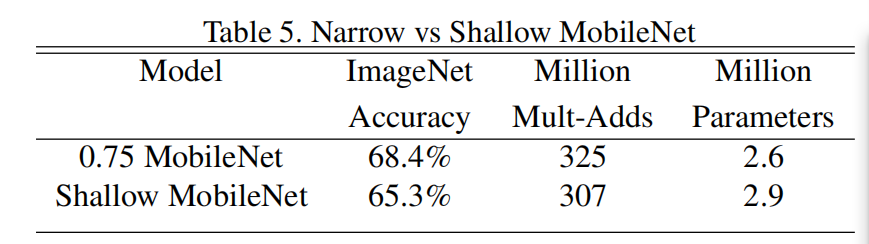

#### Model Shrinking Hyperparameters

- as $\alpha$ become smaller the accuracy drops off smoothly

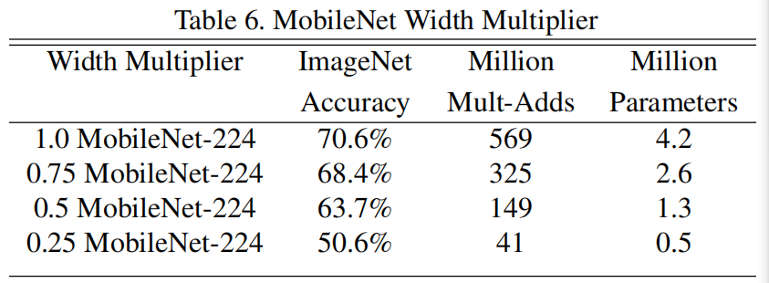

- as $\rho$ become smaller the accuracy drops off smoothly

  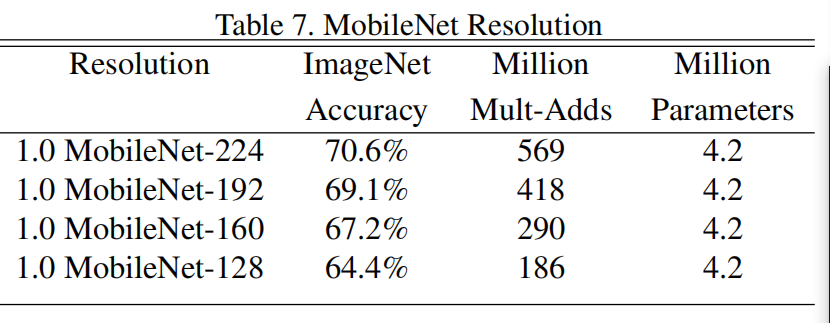

- trade off between accuracy and computation. Results are log linear with a jump when models get very small at $\alpha=0.25$

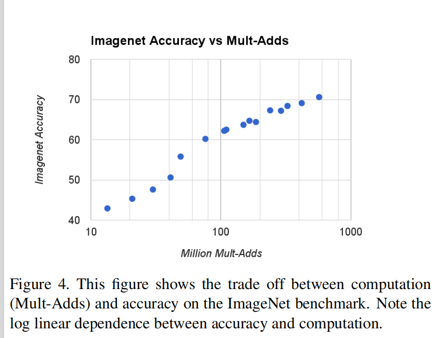

- trade off between accuracy and number of parameters.

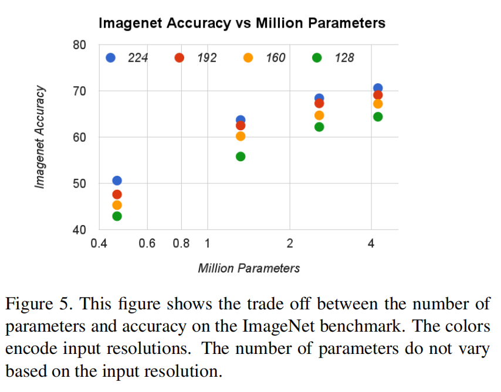

- faster and better
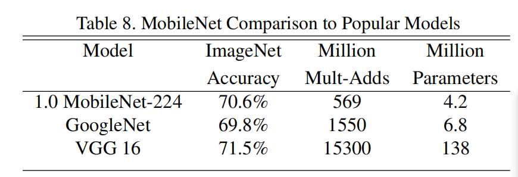
- mobilenet vs squeezenet and alexnet
 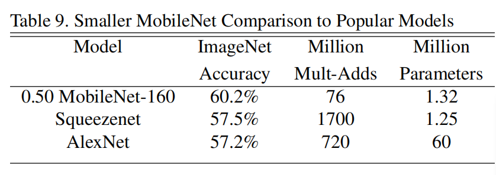

#### Fine Grained Recognition

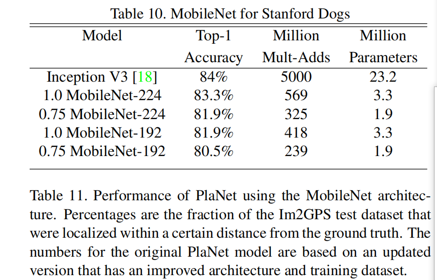

#### Large Scale Geolocalization

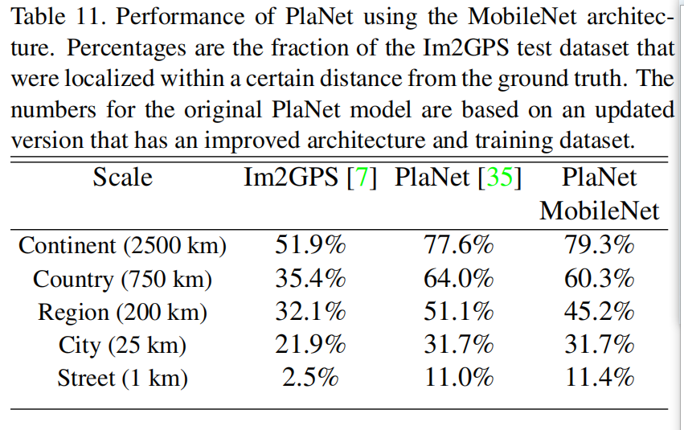

#### Face Attributes

- similar mAP and 1% computation

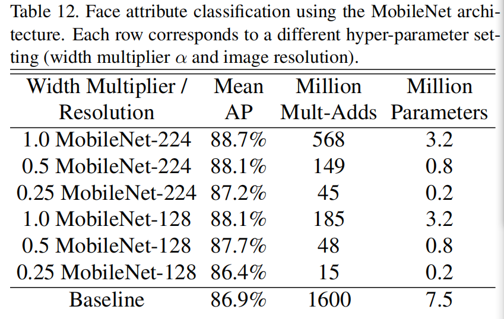

#### Object Detection

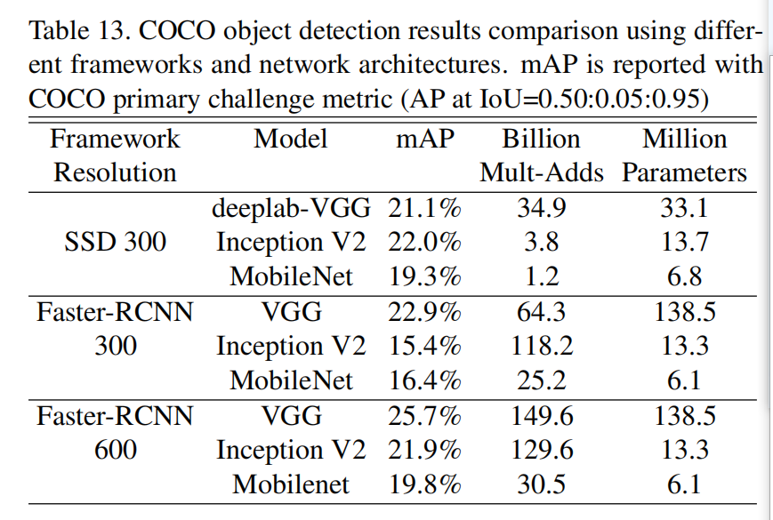

#### Face Embedding

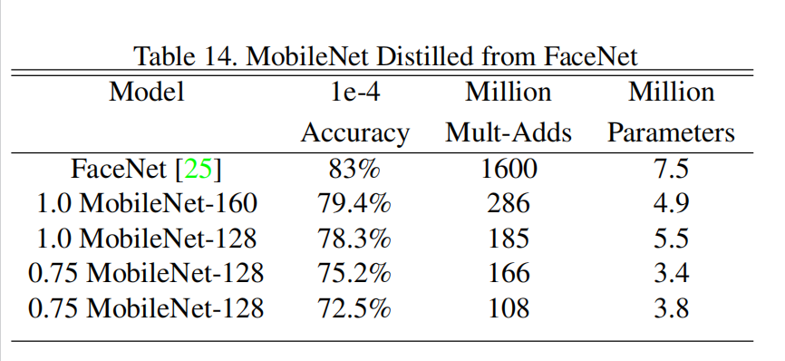

### Conclusion

- Proposed MobileNet based on depthwise separable convolutions
- trade off the accuracy and size and latency by two hyper-parameters $\alpha$ and $\beta$

### Confuse

- [x] Depth wise separable convolution

