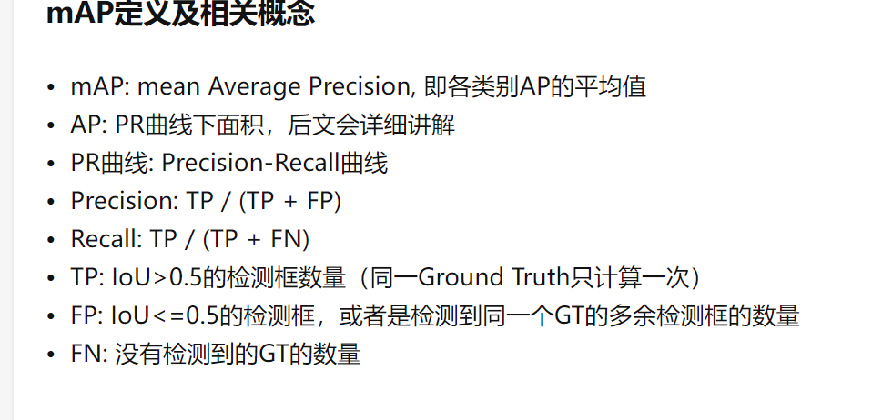
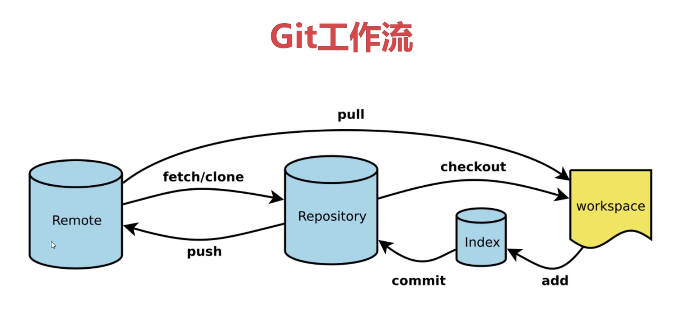

[TOC]

## Softmax

- Softmax 函数的输出是（0.0，1.0）之间的实数，并且softmax函数的输出值的总和为1. Softmax的输出可以理解为结果发生的概率。推理时不使用，学习时使用。和cross-entropy评价函数一起使用，可以使传回的误差为 $ y- true$

- 计算公式：

$$
y_k = \frac{e^{a_k+c'}}{\Sigma_{i=1}^{n}e^{a_i+c'}}
$$

## Cross entropy error

- 计算公式：
  $$
  E = - \Sigma_kt_k\log y_k
  $$

  > $t_k$只有正确解标签的索引为1，其他为0，因此这个公式实际上使计算正确解标签的输出的自然对数

## BatchNormalization

Advantage:

- make learning faster
- less dependent on initial value
- Suppress overfitting

BatchNormalization adjust the weight of layers to make ti spread widly.

Algorithm
$$
\mu_B = \frac{1}{m}\Sigma_{i=1}^mx_i
\\
\sigma_B^2 = \frac{1}{m}\Sigma_{i=1}^m(x_i-\mu_B)^2
\\
\hat{x_i} = \frac{x_i-\mu_B}{\sqrt{\sigma_B^2+\epsilon}}
$$

## Gradient vanishing

各层的激活值呈现偏向0和1的分布，随着输出不断的靠近0和1，它的导数的值逐渐接近0.因此，偏向0和偏向1的数据分布会造成反向传播中梯度的值不断变小，最后消失，这个问题称为梯度消失。

because of  back propagation, the loss is multiply by the Derivative of active function many times. so when the derivative > 1, produce exploding of gradients, when the derivative <1, produce vanishing gradients

## 表现力受限

激活值在分布上有所偏向会出现“表现力受限”问题。因为如果有多个神经元都输出几乎相同的值，那么他们就没有存在的意义了。

## 权重初始值

ReLU 用He 初始值，sigmoid或者tanh用Xavier初始值

## *list

等于取出列表的每一个元素

## 饱和非线性函数

当激活函数满足
$$
\lim_{n\rightarrow+\infty}h'(x) = 0
$$
时，函数右饱和

当激活函数满足
$$
\lim_{n\rightarrow-\infty}h'(x) = 0
$$
时，函数为左饱和

典型的函数有Sigmoid函数和tanh函数

## Domain Adaptation（邻域自适应）	

**Domain Adaptation**是迁移学习中很重要的一部分内容，目的是把分布不同的源域和目标域的数据，映射到一个特征空间中，使其在该空间中的距离尽可能近。于是在特征空间中对source domain训练的目标函数，就可以迁移到target domain上，提高target domain上的准确率

## Whitened(白化)

白化的目的是去除输入数据的冗余信息

  输入数据集X，经过白化处理后，新的数据X'满足两个性质：

(1)特征之间相关性较低；
(2)所有特征具有相同的方差。

linearly transformed to have zero means and unit variances, and decorrelated.

## Sigmoid(非线性饱和函数)

$$
S(x) = \frac{1}{1+e^{-x}}
$$

$$
S'(x) = S(x)(1-S(x))
$$

## [Depthwise separable convolution](https://zhuanlan.zhihu.com/p/165632315)

先做逐层卷积生成与输入通道数相同的特征图，在做逐点卷积，生成与输出通道数相同的特征图。可以大大减少计算量和参数。大约1/3.

1. 
2. 

## Filter and Kernel

卷积层共4个Filter，每个Filter包含了3个Kernel，每个Kernel的大小为3×3

## Refer to / with respect to / in terms of 

查阅 参考 提到/关于/依据

## mAP

## [Convariance Matrix(协方差矩阵)](https://www.cnblogs.com/chaosimple/p/3182157.html)

各个维度之间的协方差构成的对称矩阵，主对角线为方差

协方差可以用来定量描述两个维度之间的相关程度
$$
\hat\Sigma=\frac{1}{m-1}\sum_{j=1}^{m}(x_j-\bar{x})(x_j-\bar{x})^T
$$

## [Argparse](https://zhuanlan.zhihu.com/p/56922793)

## 计算模型的FLOPS 和 参数量

[Pytorch中计算自己模型的FLOPs | thop.profile() 方法 |-python黑洞网 (pythonheidong.com)](https://www.pythonheidong.com/blog/article/820386/2c3e2774b1033c7f8a9c/)

## Git 使用命令

- git add 文件名
- git commit -m ‘提交信息’
- git push
- git pull 
- git chekout 文件名 ：取本地库文件
